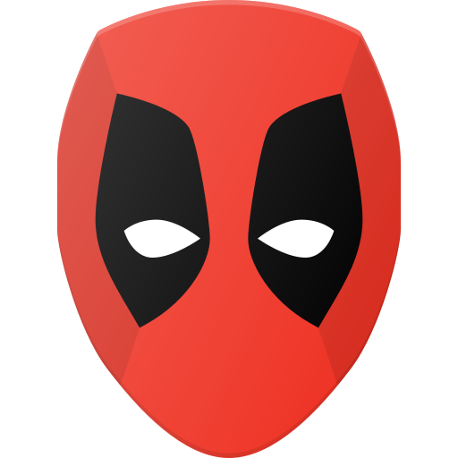

# marvel-coke-epic
Marvel and Coca Cola Epic AR Colab

[![LinkedIn][linkedin-shield]][linkedin-url]

<h2>Client</h2>

Contract: Subvrsive

<b>for Coca Cola Company and Marvel Studios</b>

<!-- PROJECT LOGO -->

 

  

<h3 align="center">Marvel Coca-Cola Epic Experience</h3>

  

Augmented reality experience in partnership with Coca-Cola and Marvel, allowing users to unlock interactive animations of their favorite Marvel characters directly from limited-edition Coca-Cola packaging.
  

<!-- ABOUT THE PROJECT -->
## About The Project

This project used 8th Wall’s image-tracking, enhanced by machine learning to recognize Marvel characters on cylindrical Coca-Cola packaging and create an immersive AR experience. Character animations were triggered on cans, bottles, and other product sizes, maintaining stability and visual quality in mobile AR.

  <h3>Challenges</h3>
   <ul>
     <li><b>Image Recognition:</b> Achieved precise AR interactions by implementing machine learning alongside 8th Wall’s image tracking, ensuring smooth recognition across diverse surfaces and product shapes.</li>
     <li><b>Model Positioning:</b> Maintaining accurate scale and position of character models on various product sizes and at different distances required precise adjustments in three.js.</li>
     <li><b>Shaders and VFX:</b> Developed optimized shaders and visual effects tailored to web-based AR, balancing quality with web performance limitations.</li>
   </ul>

https://github.com/user-attachments/assets/90ca350f-5057-4126-add8-855a94f7ecd4

https://github.com/user-attachments/assets/de683e5a-50aa-4546-b88d-a97fcb11888b

<h3>Press</h3>

<h3>Impact</h3>
<ul>
  <li><b>Global Impressions:</b> 1.95 billion</li>
  <li><b>Social Reach:</b> 24.4 billion</li>
  <li><b>Hub Activity:</b> 8 million+ page views, with 4.2 million sessions and an average dwell time of nearly 2 minutes per session.</li>
  <li><b>Engagement:</b> Users interacted with the campaign an average of 2.2 times.</li>
</ul>

(<a href="#top">back to top</a>)

<!-- LICENSE -->
## License

All intellectual property is owned by Marvel Studios and Coca Cola Company.

(<a href="#top">back to top</a>)

<!-- CONTACT -->
## Contact

Reach out - <a href="mailto:cappacurta@gmail.com">Victor Cappa</a> |
<a href="https://www.linkedin.com/in/victor-cappa-50839788/">Linkedin</a>

(<a href="#top">back to top</a>)

[linkedin-shield]: https://img.shields.io/badge/-LinkedIn-black.svg?style=for-the-badge&logo=linkedin&colorB=555
[linkedin-url]: https://www.linkedin.com/in/victor-cappa-50839788/
